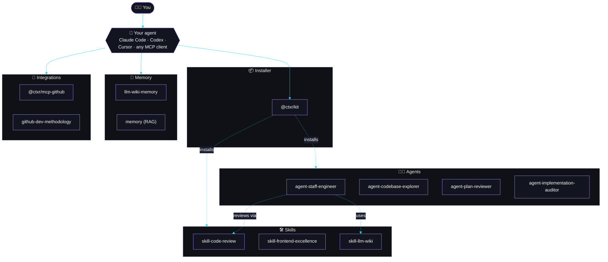

<!--
  Contexter org profile.

  GitHub renders this file at https://github.com/ctxr-dev because it
  lives at `profile/README.md` inside the org's `.github` repo. Edit
  it the same way you edit any README; changes propagate to the org
  landing page on the next page load.
-->

<div align="center">

<a href="https://github.com/ctxr-dev">
  
</a>

<br /><br />

<a href="https://github.com/ctxr-dev"></a>
<a href="https://www.npmjs.com/org/ctxr"></a>
<a href="https://github.com/ctxr-dev/.github/blob/main/profile/README.md"></a>
<a href="https://modelcontextprotocol.io"></a>

<br />

<a href="https://docs.claude.com/en/docs/agentic-coding/claude-code"></a>
<a href="https://github.com/openai/codex"></a>
<a href="https://cursor.com"></a>
<a href="https://github.com/ctxr-dev"></a>

</div>

<br />

<div align="center">
  <sub><b>Pick a memory. Add the skills you want. Drop in agents when you need more horsepower.</b></sub>
</div>

---

## ⚡ 60-second start

```bash
# 1. Run the installer (no global install)
npx @ctxr/kit

# 2. Pick a memory backend (one prompt, one decision)
#    Wiki  → https://github.com/ctxr-dev/llm-wiki-memory#install
#    RAG   → https://github.com/ctxr-dev/memory#install

# 3. Add the skill almost everyone wants
npx @ctxr/kit install @ctxr/skill-code-review
```

That is the whole start. Everything below is opt-in.

---

## 🧠 Pick your memory

Self-improving memory: your agent recalls past lessons before it works and saves a new one the moment
you correct it, so the same mistake does not recur. Both options expose the same tools and behavior, so
you can switch later. Install one, not both.

<table>
  <thead>
    <tr>
      <th></th>
      <th align="center">📒 Wiki<br/><sub>recommended</sub></th>
      <th align="center">🧬 RAG</th>
    </tr>
  </thead>
  <tbody>
    <tr>
      <td><b>Repo</b></td>
      <td align="center">
        <a href="https://github.com/ctxr-dev/llm-wiki-memory"></a><br/>
        <a href="https://github.com/ctxr-dev/llm-wiki-memory"></a>
      </td>
      <td align="center">
        <a href="https://github.com/ctxr-dev/memory"></a><br/>
        <a href="https://github.com/ctxr-dev/memory"></a>
      </td>
    </tr>
    <tr>
      <td><b>Stores as</b></td>
      <td>git-versioned markdown in your repo</td>
      <td>local Dify vector store</td>
    </tr>
    <tr>
      <td><b>Infra</b></td>
      <td>none (Node + git)</td>
      <td>Docker + Dify</td>
    </tr>
    <tr>
      <td><b>Best for</b></td>
      <td>solo, small, and medium projects; offline; low overhead</td>
      <td>large corpora; teams; retrieval precision at scale</td>
    </tr>
    <tr>
      <td><b>One-prompt AI install</b></td>
      <td><a href="https://github.com/ctxr-dev/llm-wiki-memory#install">llm-wiki-memory#install</a></td>
      <td><a href="https://github.com/ctxr-dev/memory#install">memory#install</a></td>
    </tr>
  </tbody>
</table>

> **Default to Wiki.** Choose RAG when the corpus is large, several people or agents share one store, or
> Docker is already in your stack. Not ready for persistent memory? Skip it. Nothing else depends on it.

---

## 🗺️ How the pieces fit



---

## 📦 Installer

| Package | Use it to | Badges |
| --- | --- | --- |
| [`@ctxr/kit`](https://github.com/ctxr-dev/kit) | install, update, and scaffold skills and agents (`npx @ctxr/kit`, no global) | [](https://www.npmjs.com/package/@ctxr/kit) [](https://github.com/ctxr-dev/kit) |

---

## 🛠️ Skills

> Install any skill with `npx @ctxr/kit install @ctxr/<name>`.

| Skill | Use it to | Badges |
| --- | --- | --- |
| [`@ctxr/skill-code-review`](https://github.com/ctxr-dev/skill-code-review) | multi-specialist review with a GO / NO-GO verdict | [](https://www.npmjs.com/package/@ctxr/skill-code-review) [](https://github.com/ctxr-dev/skill-code-review) |
| [`@ctxr/skill-frontend-excellence`](https://github.com/ctxr-dev/skill-frontend-excellence) | ship fast, accessible, distinctive web UI (Lighthouse 95+ mobile, 99+ desktop) | [](https://www.npmjs.com/package/@ctxr/skill-frontend-excellence) [](https://github.com/ctxr-dev/skill-frontend-excellence) |
| [`@ctxr/skill-llm-wiki`](https://github.com/ctxr-dev/skill-llm-wiki) | make your agent read docs and code token-efficiently | [](https://www.npmjs.com/package/@ctxr/skill-llm-wiki) [](https://github.com/ctxr-dev/skill-llm-wiki) |

---

## 🧑‍🚀 Agents

> Install with `npx @ctxr/kit install @ctxr/<name>`.

| Agent | Use it to | Badges |
| --- | --- | --- |
| [`@ctxr/agent-staff-engineer`](https://github.com/ctxr-dev/agent-staff-engineer) | drive a ticket to an open PR, then hand off before merge (pulls in `skill-llm-wiki`, reviews via `skill-code-review`) | [](https://www.npmjs.com/package/@ctxr/agent-staff-engineer) [](https://github.com/ctxr-dev/agent-staff-engineer) |
| [`@ctxr/agent-codebase-explorer`](https://github.com/ctxr-dev/agent-codebase-explorer) | read-only "where is X / what references Y" search subagent, capped structured reports | [](https://www.npmjs.com/package/@ctxr/agent-codebase-explorer) [](https://github.com/ctxr-dev/agent-codebase-explorer) |
| [`@ctxr/agent-plan-reviewer`](https://github.com/ctxr-dev/agent-plan-reviewer) | adversarially review a plan or design *before* you confirm it: gaps, blind spots, edge cases, infeasibilities | [](https://www.npmjs.com/package/@ctxr/agent-plan-reviewer) [](https://github.com/ctxr-dev/agent-plan-reviewer) |
| [`@ctxr/agent-implementation-auditor`](https://github.com/ctxr-dev/agent-implementation-auditor) | post-build conformance audit: missed plan items, divergences, cross-implementation parity | [](https://www.npmjs.com/package/@ctxr/agent-implementation-auditor) [](https://github.com/ctxr-dev/agent-implementation-auditor) |

> 💡 The codebase-explorer, plan-reviewer, and implementation-auditor are **read-only by design**: their tool surface is scoped to `Read / Grep / Glob / Bash`, so a flaky MCP connector cannot kill subagent init. Drop them in front of the staff-engineer loop or use them standalone.

---

## 🔌 MCP servers

| Server | Use it to | Setup | Badges |
| --- | --- | --- | --- |
| [`@ctxr/mcp-github`](https://github.com/ctxr-dev/mcp-github) | structured GitHub tool calls instead of `gh` shell-outs | [register it](https://github.com/ctxr-dev/mcp-github#use-as-an-mcp-server) | [](https://www.npmjs.com/package/@ctxr/mcp-github) [](https://github.com/ctxr-dev/mcp-github) |

---

## 📐 Methodology

| Repo | Use it to | How | Badges |
| --- | --- | --- | --- |
| [`ctxr-dev/github-dev-methodology`](https://github.com/ctxr-dev/github-dev-methodology) | a consistent GitHub issue and PR workflow, plus subagent orchestration | clone into your project; [read it](https://github.com/ctxr-dev/github-dev-methodology) | [](https://github.com/ctxr-dev/github-dev-methodology) |

---

## 📚 Libraries

| Package | Use it to | Badges |
| --- | --- | --- |
| [`@ctxr/fsm`](https://github.com/ctxr-dev/fsm) | author your own deterministic multi-agent workflow (usually transitive, via a skill or agent) | [](https://www.npmjs.com/package/@ctxr/fsm) [](https://github.com/ctxr-dev/fsm) |

---

## 🌐 Recommended external plugins

The ctxr stack plays nicely with other open skill and agent collections. A few we like:

| Source | Install | What you get |
| --- | --- | --- |
| [`mattpocock/skills`](https://github.com/mattpocock/skills) | `npx skills@latest add mattpocock/skills` | Matt Pocock's TypeScript and authoring skills, batteries included |
| [`anthropics/skills`](https://github.com/anthropics/skills) | `npx skills@latest add anthropics/skills` | Anthropic's reference skills (PDFs, spreadsheets, Office, web-design) |
| [`wshobson/agents`](https://github.com/wshobson/agents) | clone and point your agent loader at it | Community catalog of Claude Code subagents |

> The `npx skills@latest add <owner>/<repo>` pattern works for any GitHub repo that follows the
> [skills](https://github.com/anthropics/skills) layout. Use `@ctxr/kit` for ctxr packages, `skills` CLI
> for everything else, side by side.

---

## 🎯 Starter stacks

<table>
  <thead>
    <tr><th>Stack</th><th>What you install</th><th>Why</th></tr>
  </thead>
  <tbody>
    <tr>
      <td><b>🧍 Solo / side project</b></td>
      <td><code>kit</code> + Wiki memory + <code>skill-code-review</code><br/><sub>add <code>skill-frontend-excellence</code> if you ship web UI</sub></td>
      <td>zero infra, every commit reviewed, lessons accumulate</td>
    </tr>
    <tr>
      <td><b>👥 Small team on GitHub</b></td>
      <td>above + <code>github-dev-methodology</code> (<code>pr-only</code> preset) + <code>mcp-github</code></td>
      <td>shared PR loop without imposing the whole methodology at once</td>
    </tr>
    <tr>
      <td><b>🏢 Larger team</b></td>
      <td>RAG memory + <code>skill-code-review</code> + <code>agent-staff-engineer</code> + <code>agent-plan-reviewer</code> + <code>agent-implementation-auditor</code> + methodology (<code>full</code> preset) + <code>mcp-github</code></td>
      <td>plan is adversarially reviewed, build is automated, output is audited against plan</td>
    </tr>
  </tbody>
</table>

---

## 🤝 Contribute

All repos are MIT licensed and developed in the open at **[github.com/ctxr-dev](https://github.com/ctxr-dev)**.

- 🐞 Found a bug? Open an issue on the relevant repo.
- 💡 Have an idea? Discussions are on, fire away.
- 🛠️ Want to ship a skill or agent under `@ctxr/`? Start from [`@ctxr/kit`](https://github.com/ctxr-dev/kit) and PR it.

<div align="center">
  <br/>
  <sub><b>Built in the open for agents that ship.</b></sub>
  <br/><br/>
  
</div>
